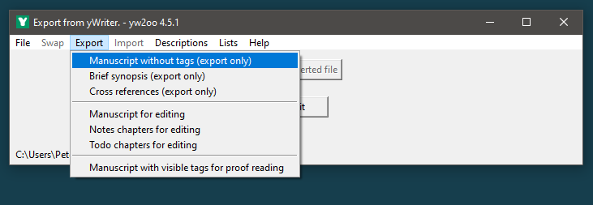

[yWriter](http://spacejock.com/yWriter7.html) is a free word processor written by Australian author and programmer Simon Haynes. yWriter's strengths are structuring novels and controlling the progress during the writing process. With this Python script, you can combine the advantages of yWriter 7 with the advantages of OpenOffice/LibreOffice.

## Features (a Python 3 installation is required)

- Launch via Windows Explorer context menu. Optionally, use the graphical user interface to select the yWriter project and the export    document type. 
- Generate a "standard manuscript" formatted **ODF text document (ODT)** from a yWriter 7 project.
- Load yWriter 7 chapters and scenes into an OpenDocument file with chapter and scene markers for **proof reading** and writing back.
- Generate a **brief synopsis** with chapter and scene titles from a yWriter 7 project.
- Generate a **character list** that can be edited in Office Calc and written back to yWriter format.
- Generate a **location list** that can be edited in Office Calc and written back to yWriter format.
- Generate an **item list** that can be edited in Office Calc and written back to yWriter format.
- Generate an OpenDocument text file containing navigable **cross references** , such as scenes per character, characters per tag, etc.
- The application is ready for internationalization with GNU gettext. A German localization is provided. 

With the [pywoo extension for OpenOffice](https://peter88213.github.io/pywoo) and the [yw-cnv extension for LibreOffice](https://peter88213.github.io/yw-cnv), you can write your edited Office documents back to the yWriter project.

    
## Requirements

- [Python 3.6+](https://www.python.org).  

## Please note: 

yW2OO was fundamentally revised. If you want to update it from a version less than v3, 
first uninstall your current yW2OO installation with its included **Uninstall.bat** script.

## Download and install

[Download the latest release (version 4.2.2)](https://raw.githubusercontent.com/peter88213/yW2OO/main/dist/yW2OO_v4.2.2.zip)

[Instructions for installation and use](usage)

[Changelog](changelog)

## Credits

The icons are made using the free *Pusab* font by Ryoichi Tsunekawa, [Flat-it](http://flat-it.com/).

## License

yW2OO is distributed under the [MIT License](http://www.opensource.org/licenses/mit-license.php).

 

